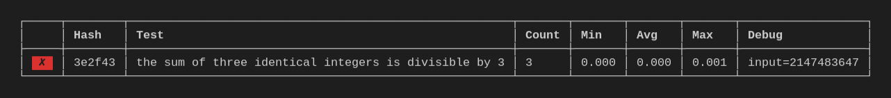

[](https://github.com/propensive/probably/actions)
[](https://discord.gg/7b6mpF6Qcf)


# Probably

__To probe what we can't prove, so what isn't provable may be probable__

__Probably__ is a testing library designed to unintrusively provide test recording and reporting capabilities to any
codebase, regardless of the users&rsquo; choices of libraries or programming paradigms. __Probably__ can define and run
unit tests and property tests. Its syntax is simple and unexciting, and its execution model has zero magic:
it&rsquo;s the same as for any other program.

## Features

- no framework, reflection or control flow to understand
- ScalaCheck-style property testing
- tests may be run multiple times, with results aggregated
- automatic derivation of arbitrary instances
- functional API where it matters; impure calls where it's safe and practical


## Availability Plan

Probably has not yet been published. The medium-term plan is to build Probably
with [Fury](/propensive/fury) and to publish it as a source build on
[Vent](/propensive/vent). This will enable ordinary users to write and build
software which depends on Probably.

Subsequently, Probably will also be made available as a binary in the Maven
Central repository. This will enable users of other build tools to use it.

For the overeager, curious and impatient, see [building](#building).

## Getting Started

_Probably_ defines only two primary types: a mutable `Runner` for recording test results and reporting back on
them, and `Test` definitions, whose instances are created by the `Runner`.

Although it is possible to construct and use different `Runner`s, the most typical usage is to use the global
singleton `Runner` called `test`, because for most purposes only one `Runner` will be required. Defining a test
is simple. For example,
```scala
import probably.*

test(t"the sum of two identical integers is divisible by two"):
  val x: Int = 7
  x + x
.assert(_%2 == 0)
```

Note that the assertion takes a predicate lambda, which operates on the result from evaluating the body of the
test. It does not operate on the value directly. This clearly separates the process of running the test from the
check which is performed upon it.

When a test definition like this is encountered in running code, its body will be evaluated, and a predicate
(defined as a parameter to `assert`) will be evaluated on the result of the body. The outcome of this will be
one of four possibilities:
- the predicate returns true, and the test passes
- it returns false, and the test fails
- an exception is thrown while the body is being evaluated
- an exception is thrown while the assertion is being evaluated

These different cases will be distinguished in the test report.

It is important to note that a test can be defined anywhere, such as,
- in the `main` method of an application
- in a `lazy val`
- inside an asynchronous `Task`
- in a parameterized method, testing a property of that parameter
- in the request handler on a web server
- in a pattern extractor (`unapply` method)
- inside an actor
- in the Scala REPL
- as one branch of a case clause
- nested inside another test

Regardless of where the test is defined, the behavior is always the same: it will be evaluated, checked, and the
result will be recorded in the `Runner`, as a side-effect. Tests may be run more than once (in which case they
are recorded more than once, and aggregated) or not at all if, by virtue of some runtime criterion, they are
simply not executed. The question of whether the test is executed is the same for 

The decision to make the `Runner` mutable reflects the power of Scala's hybrid nature. The state of the `Runner`
is write-only while the tests are being run, so many of the common concurrency problems which arise with mutable
state do not apply. The `Runner` has one read-only method, `report()`, which will produce a summary report of
the recorded test results. Reports may be produced many times, but normally `report()` is called just once, at
the end. This conscious and careful compromise in functional purity buys convenience: integration of tests does
not impose constraints on new code, or require non-local changes to existing code.

### Parameterized tests

As tests may appear anywhere, they are easy to parameterize. We could, for example, rewrite the test above like
so,
```scala
import probably.*

def runTest(x: Int): Unit =
  test(t"the sum of three identical integers is divisible by 3"):
    x + x + x
  .assert(_%3 == 0)

runTest(2)
runTest(50)
runTest(Int.MaxValue)
```

However, if the test were to fail, it would be useful to know what input caused it to fail. Any number of inputs
can be logged by including them as additional named parameters after the test name, like this:
```scala
import probably.*

def runTest(x: Int): Unit =
  test(t"the sum of three identical integers is divisible by 3", input = x):
    x + x + x
  .assert(_%3 == 0)
```

The choice of the parameter name `input` is the user&rsquo;s choice: any name that is a valid identifier may be
chosen. The output from running the above tests will be displayed like this:


### Property-based testing

The ability to run the same test multiple times with different parameters suggests an obvious approach to
property-based testing: to run the same test over and over again with a stream of different inputs. _Probably_
also provides the means to generate such streams of increasingly-obscure instances for a variety of primitive
types, and will derive generators on-demand for case-class and sealed-trait types for which generators exist for
each of the parameters.

```scala
import probably.*

case class Person(name: Text, age: Int)

Generate.stream[Person](1000).foreach { person =>
  test(t"all persons have realistic ages", v = person):
    person.age
  .assert { a => a >= 0 && a < 100 }
}
```

For a given `Seed`, the pseudorandom data generated will always be deterministic and hence repeatable.

### Command-line Interface

_Probably_ comes with a simple CLI runner for running test suites through the standard shell interface. This
works particularly well for objects containing a series of unit tests. To use the command-line interface,
create an object which extends `Suite`, giving the test suite a name. Then implement the `run` method to execute
the tests, in order, like so:
```scala
object ProjectTests extends Suite("Project tests"):
  def run(using Runner): Unit =
    test(t"first test"):
      // test body
    .assert(/* predicate */)
```

The `Suite` class provides an implementation of a `main` method, so any object which subclasses `Suite` may be
run from the command line.

### Test Expression

_Probably_ provides a second way of defining a test: as an expression. For example,
```scala
import probably.*
import java.io.*

test(t"check the backup exists"):
  File("data.bak")
.check(_.exists).setReadOnly()
```

This style should look familiar, apart from one superficial difference: the test predicate is applied to a
method called `check` instead of `assert`. This transforms the test from a statement into an expression, which
means that it returns the result of its body, instead of `Unit`. Note that it returns the value, regardless of
whether the test passes or fails, and execution continues.

This confers a few further differences with assertion tests:
- exceptions thrown inside the body are not caught (but are recorded); exceptions in the check are still caught
- test expressions cannot be skipped; their return value is necessary for execution to continue

### Test Suites

A test suite is a convenient grouping of related tests, and can be launched from a runner (the value `test` in
the following example) like so:
```scala
test.suite("integration tests") { test =>
  test(t"end-to-end process"):
    System.process()
  .assert(_.isSuccess)
}
```

Like other tests, a suite has a name, and will be executed at the point it is defined, and like other tests, it
will pass or fail (or, produce mixed results). Its body, however, is a lambda which introduces a new `Runner`
instance which will be used to run the tests in the suite. By convention, the new `Runner` is also named `test`.
This will shadow the outer one, which is usually the desired behavior.

When the test suite completes, its results are aggregated into the report of the runner which spawned it. If you
launched it using the CLI, the table of results will show the nested tests indented.

The `Runner` introduced by the `suite` method is the same as any other `Runner`, so further test suites can be
defined inside other test suites, making it possible to organise tests into a hierarchy.


## Status

Probably is classified as __maturescent__. For reference, Scala One projects are
categorized into one of the following five stability levels:

- _embryonic_: for experimental or demonstrative purposes only, without any guarantees of longevity
- _fledgling_: of proven utility, seeking contributions, but liable to significant redesigns
- _maturescent_: major design decisions broady settled, seeking probatory adoption and refinement
- _dependable_: production-ready, subject to controlled ongoing maintenance and enhancement; tagged as version `1.0.0` or later
- _adamantine_: proven, reliable and production-ready, with no further breaking changes ever anticipated

Projects at any stability level, even _embryonic_ projects, can still be used,
as long as caution is taken to avoid a mismatch between the project's stability
level and the required stability and maintainability of your own project.

Probably is designed to be _small_. Its entire source code currently consists
of 785 lines of code.

## Building

Probably will ultimately be built by Fury, when it is published. In the
meantime, two possibilities are offered, however they are acknowledged to be
fragile, inadequately tested, and unsuitable for anything more than
experimentation. They are provided only for the necessity of providing _some_
answer to the question, "how can I try Probably?".

1. *Copy the sources into your own project*
   
   Read the `fury` file in the repository root to understand Probably's build
   structure, dependencies and source location; the file format should be short
   and quite intuitive. Copy the sources into a source directory in your own
   project, then repeat (recursively) for each of the dependencies.

   The sources are compiled against the latest nightly release of Scala 3.
   There should be no problem to compile the project together with all of its
   dependencies in a single compilation.

2. *Build with [Wrath](https://github.com/propensive/wrath/)*

   Wrath is a bootstrapping script for building Probably and other projects in
   the absence of a fully-featured build tool. It is designed to read the `fury`
   file in the project directory, and produce a collection of JAR files which can
   be added to a classpath, by compiling the project and all of its dependencies,
   including the Scala compiler itself.
   
   Download the latest version of
   [`wrath`](https://github.com/propensive/wrath/releases/latest), make it
   executable, and add it to your path, for example by copying it to
   `/usr/local/bin/`.

   Clone this repository inside an empty directory, so that the build can
   safely make clones of repositories it depends on as _peers_ of `probably`.
   Run `wrath -F` in the repository root. This will download and compile the
   latest version of Scala, as well as all of Probably's dependencies.

   If the build was successful, the compiled JAR files can be found in the
   `.wrath/dist` directory.

## Contributing

Contributors to Probably are welcome and encouraged. New contributors may like
to look for issues marked
[beginner](https://github.com/propensive/probably/labels/beginner).

We suggest that all contributors read the [Contributing
Guide](/contributing.md) to make the process of contributing to Probably
easier.

Please __do not__ contact project maintainers privately with questions unless
there is a good reason to keep them private. While it can be tempting to
repsond to such questions, private answers cannot be shared with a wider
audience, and it can result in duplication of effort.

## Author

Probably was designed and developed by Jon Pretty, and commercial support and
training on all aspects of Scala 3 is available from [Propensive
O&Uuml;](https://propensive.com/).


## Name

The name _Probably_ acknowledges an appropriate level of confidence in writing tests which _probe_ the functionality of a program, in contrast to using types which (in theory, at least) _prove_ it.

In general, Scala One project names are always chosen with some rationale,
however it is usually frivolous. Each name is chosen for more for its
_uniqueness_ and _intrigue_ than its concision or catchiness, and there is no
bias towards names with positive or "nice" meanings—since many of the libraries
perform some quite unpleasant tasks.

Names should be English words, though many are obscure or archaic, and it
should be noted how willingly English adopts foreign words. Names are generally
of Greek or Latin origin, and have often arrived in English via a romance
language.

## Logo

The logo shows a twenty-sided die, an icosahedron, alluding to probabilistic chance.

## License

Probably is copyright &copy; 2024 Jon Pretty & Propensive O&Uuml;, and
is made available under the [Apache 2.0 License](/license.md).

